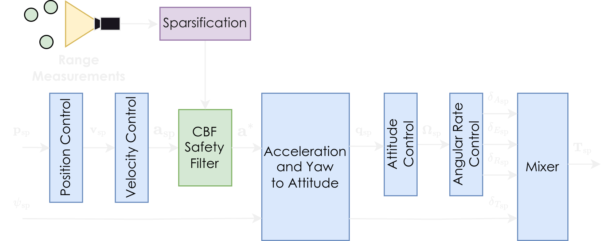

# PX4-CBF

## Safety Filter Overview

This repository presents the instructions to use the embedded CBF-based safety filter for collision avoidance, designed for integration into the PX4 Autopilot.
The filter operates using real-time onboard range measurements and velocity estimation.
It is integrated into the PX4 position/velocity control loop and makes optimally minimal modifications to the acceleration setpoint to prevent collisions.

The safety filter is compatible with various range and depth sensors mounted on the multirotor, including, e.g., Intel RealSense D455 and alike, small-scale Time-of-Flight sensors, or LiDARs.

When using a laterally constrained-FoV sensor, additional motion constraints can be applied within the CBF to restrict movement outside the sensor's FoV.
Note: The unconstrained-FoV case relies on computing an analytical solution to the underlying CBF-QP, which is computationally efficient.
However, the constrained-FoV case requires additional computational resources on the controller board.



## Tested Hardware

The proposed CBF safety filter was successfully compiled and tested on [PixRacer Pro](https://mrobotics.io/docs/pixracer-pro/) and [VOXL2 Mini](https://www.modalai.com/products/voxl-2-mini) Flight Controllers.

## Dependencies

### QP solver

As the safety filter relies on solving a minimization problem, the use of a solver is required (when FoV constrains are engaged).
We use a fork of [qpOASES](https://github.com/ntnu-arl/qpOASES/tree/dev/cbf) in which we removed some includes that are not usable on some standard PX4 Boards which prevent dynamic memory allocation.

> Note: The qpOASES implementation is currently not working on the PixRacer Pro board and leads to firmware crashes. We are currently investigating this issue.

### Module In/Out Messages

Our method requires modified versions of [mavlink](https://github.com/mavlink/mavlink) and [mavros](https://github.com/mavlink/mavros), that implements the relevant ROS and uORB messages.
Those messages include:
* List of 3D point of obstacles, split in chunks to cope for the mavlink maximum message size limitations.
* CBF debug message, exposing useful information for users through PX4 logs and ROS.

The mavlink fork is included as submodule in our [modified PX4 fork](https://github.com/ntnu-arl/PX4-Autopilot/tree/cbf).

Additionally, users need to clone and install (though catkin) the corresponding mavlink and mavros version in their ROS workspaces:
* https://github.com/ntnu-arl/mavlink/tree/dev/px4-v1.15.3/cbf
* https://github.com/ntnu-arl/mavros/tree/dev/voxl/cbf

> Note: because the VOXL SDK works with previous releases of mavlink, we also based our modification from the proper version on [this branch](https://github.com/ntnu-arl/mavlink/tree/dev/voxl/cbf).

### Pointcloud downsampling

The safety filter is scalable wrt the number of obstacles consired as the avoidance problem is lumped into a single constraint.
Using the whole pointcloud is however redundant and implies a large computation overhead for computing the composite CBF.

We propose a Python [ROS1 module](https://github.com/ntnu-arl/cbf_pc_selector) for downsampling pointclouds, and selecting the N closest points to be sent to PX4.
The downsampling is achieved by selecting the minrange in a given number of angular bins.
The module can be installed normally through Catkin.

## Build / Install Instructions for Standard PX4 Flight Controllers

As the safety filter is implemented as part of the PX4 position controller, no additional changes are necessary aside from building and flashing the firmware (following instruction [here](https://docs.px4.io/main/en/dev_setup/building_px4.html)).
Certain flight controllers may return memory errors due to the QP library used, these are simple solved by disabling unnecessary components in `<PX4-firmware_repo/boards/<specific_board>/default.px4board`.

## Build / Install Instructions for ModalAI VOXL SDK

### Why a second fork

We also propose a realization of our implementation for the ModalAI VOXL SDK.
Our [public fork](https://github.com/ntnu-arl/voxl-px4/tree/cbf) of the [VOXL SDK](https://gitlab.com/voxl-public/voxl-sdk/services/voxl-px4) is based on the [SDF 1.2.0 release](https://gitlab.com/voxl-public/voxl-sdk/services/voxl-px4/-/tags/sdk-1.2.0).
We note that our fork contains no modification to the VOXL SDK itself, but change the px4-firmware submodule to [our modified PX4 implementation](https://github.com/ntnu-arl/modalai-px4-firmware), based on the older release used by VOXL.

### VOXL-speficic build instructions

This instructions hereafter are taken from the voxl-px4 repo.

* Setup ADB on the host computer: [https://docs.modalai.com/setting-up-adb/](https://docs.modalai.com/setting-up-adb/)
* Clone the repository
```
git clone git@github.com:ntnu-arl/voxl-px4.git
cd voxl-px4
git checkout cbf
git submodule update --init --recursive
```
* Launch the docker and build
```
./run-docker.sh
./clean.sh
./build.sh
```
* Package the firmware
```
./make_package.sh
```
* Install the package on the board (through ADB)
```
px4-firmware/boards/modalai/voxl2/scripts/install-voxl.sh
```

## CBF parameters

Our PX4 implementation exposes tunable parameters that can be accessed through [QGC](https://qgroundcontrol.com/).


The **CBF_ENABLE** flag allows user to engage or not the CBF safety filter.
If set to false, the position/velocity control loop will act exactly as in the vanilla PX4 implementation.

The most critical parameters that user may need to tune are presented in this table, along with a summary of their effect on the filter behavior.

| Parameter       | Range     | Effect when increasing       |
| --------------- | --------- | ---------------------------- |
| CBF_EPSILON     | >0        | Larger avoidance radius      |
| CBF_KAPPA       | [10, 100] | Less smooth approximation    |
| CBF_GAMMA       | [10, 100] | Reacts to farther obstacles  |
| CBF_ALPHA       | [1, 3]    | Increased filter sensitivity |
| CBF_POLE0       | [-3, -1]  | Damped response              |
| CBF_LP_GAIN_OUT | [0, 1]    | Lesser accel. smoothing      |
| CBF_ALPHA_FOV   | [2, 8]    | More aggressive FoV response |

## Reference, Acknowledgments

If you use this work in your research, please cite the following publication:

```
@INPROCEEDINGS{Harms2025Safe,
  AUTHOR={Marvin Harms and Martin Jacquet and Kostas Alexis},
  TITLE={Safe Quadrotor Navigation using Composite Control Barrier Functions},
  BOOKTITLE={IEEE International Conference on Robotics and Automation (ICRA)},
  YEAR={2025},
  URL={https://arxiv.org/abs/2502.04101},
}
```

The embedded implementation work is currently under review.

We would like to acknowledge the contribution of [Morten Nissov](https://github.com/mnissov) and [Nazar Misyats](https://github.com/Krafpy) to the proposed embedded implementation.

## Contacts

* [Marvin Harms](mailto:marvin.c.harms@ntnu.no)
* [Morten Nissov](mailto:morten.nissov@ntnu.no)
* [Martin Jacquet](mailto:marvin.jacquet@ntnu.no)
* [Kostas Alexis](mailto:konstantinos.alexis@ntnu.no)
